# Watt Forge

**Converter design from first principles, down to the last milliwatt.** An open-source, web-based and downloadable platform that teaches DC-DC converter design from duty cycle to expert-level loss modelling, lets you design and validate converters against an efficiency target, and ends in a complete reference design: a **hybrid three-level GaN buck-boost for solar**.

> **Safety.** This is a design and simulation reference, not a build-and-energize guide. Solar and battery hardware is dangerous: high voltage, stored energy, fire. Any physical build is at your own risk and needs proper lab safety practice. Read [SAFETY.md](SAFETY.md).

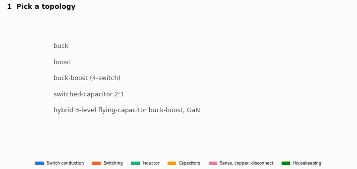

## Two ways to use it

| | How | What you get |
|---|---|---|
| **Web app** | `https://<your-user>.github.io/watt-forge/` (GitHub Pages, from `docs/`) | Everything runs in the browser: no accounts, no analytics, no third-party requests. Use the browser's **Install app** button and it works offline. |
| **Desktop app** | Installers on the **Releases** page: Linux `.deb`/`.rpm`/`.AppImage`, Windows `.msi`/`.exe`, macOS `.dmg` | The same site, offline, plus a **live, sandboxed ngspice** SPICE runner. See [desktop/README.md](desktop/README.md). |

To publish both from a blank Ubuntu terminal with one paste, see [docs/PUBLISH.md](docs/PUBLISH.md).

## What is inside

| Part | Where | What it does |
|---|---|---|
| **The course** (7 lessons) | `docs/learn/` | Fundamentals, the core topologies, switched-capacitor and hybrid converters, loss modelling, devices (Si/GaN/SiC and bidirectional GaN), control and MPPT, and the research frontier. Every equation gets intuition, symbols and units, a worked example the test suite checks, and an interactive visual. |
| **Six tools** | `docs/tools/` | Topology designer (sizes L and C, finds duty, estimates every loss), loss-budget explorer, efficiency-curve validator, Si vs GaN vs SiC comparison with a thermal estimate, MPPT sandbox, and the SPICE runner (netlists behind the numbers; live ngspice in the desktop app). |
| **Physics library** | `watt_forge/` | Ratios, balance laws, CCM/DCM, every loss primitive, Steinmetz/iGSE, switched-capacitor SSL/FSL, weighted efficiency, a PV panel model, and the generic designer. Ported line-for-line to `docs/js/model/` and parity-tested. |
| **Flagship design** | `watt_forge/flagship/`, `hardware/flagship/` | Topology, parameters, analytic loss model, time-domain circuit simulation, ngspice cross-check, design exploration, BOM, schematic, spreadsheet, notebook, reference controller (C) and modulator (Verilog). |
| **Desktop** | `desktop/` | Tauri 2 app around the same site, plus a sandboxed ngspice back end guarded by `netlist-guard` (Rust). Built, packaged and smoke-tested end to end. |

## The core topologies, animated

Each animation shows the current path in each switch state (dashes flow with the current) and the switch-node voltage and inductor current, with a cursor.

| Buck | Boost |
|---|---|
|  |  |
| **Inverting buck-boost** | **Flagship three-level leg** |
|  |  |

SEPIC, Cuk, flyback and four-switch animations are in `docs/img/` and lesson 2.

## The flagship: hybrid three-level GaN buck-boost for solar


**12-60 V panel to a 40-58 V (48 V) battery, 400 W, maximum power point tracking.** A four-switch buck-boost whose half-bridges are replaced by **three-level flying-capacitor legs** on 100 V GaN (EPC2361):

- **Half the blocking voltage.** Each switch blocks Vbus/2.
- **Up to 4x less ripple.** The switch node steps in half-size steps at twice the switching frequency.
- **A built-in switched-capacitor stage.** At Vout = 2 Vin the leg is a soft-charged 2:1 SC converter with near-zero inductor ripple.

A monolithic **bidirectional GaN switch** (Innoscience INV100FQ030C) disconnects the panel in both directions, and another bypasses conversion entirely when the panel's maximum power point already sits at battery voltage.

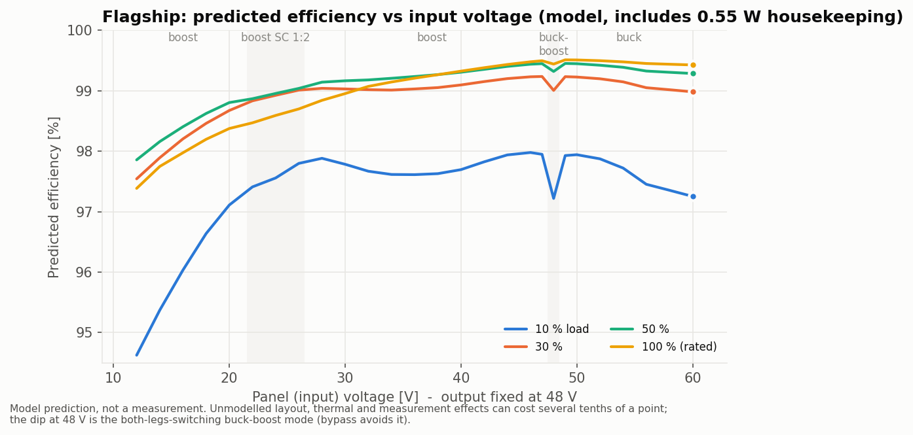

| Operating point (model) | Mode | f | Loss | Efficiency |
|---|---|---|---|---|
| 56 V -> 48 V, 400 W | buck | 75 kHz | 2.21 W | **99.45 %** |
| 36 V -> 48 V, 300 W | boost | 75 kHz | 2.23 W | 99.26 % |
| 24 V -> 48 V, 300 W | boost, SC 1:2 | 100 kHz | 3.82 W | 98.74 % |
| 12 V -> 48 V, 175 W | boost | 75 kHz | 4.69 W | 97.39 % |
| 48 V, 400 W | bypass | - | 1.07 W | 99.73 % |

All efficiencies include 0.55 W of housekeeping. CEC-weighted efficiency is 97.5 % at 12 V, 98.8 % at 24 V, 99.1 % at 36 V and 99.25 % at 56 V.

**How much to trust these numbers.** Three independent calculations agree:

- the analytic model, edge by edge;
- a time-domain circuit simulation (exact piecewise-linear periodic steady state, dead time, reverse conduction, unbalanced flying capacitors), within 0.15 points of the model;
- ngspice, within 5e-5 of the simulation.

That proves the arithmetic, not the hardware. The best *measured* GaN buck-boost results we could verify are 99.0 % (TI TIDA-010949, control power excluded) and 99.3 % (Heydari et al., APEC 2023). Treat predictions above ~99.3 % as claims awaiting a prototype. Every assumption that is an estimate is labelled `ESTIMATE` in `watt_forge/flagship/params.py`.

**Where the physics says no:**

- **Low input voltage.** At 12 V the converter carries 15 A through four series switches, the inductor and the disconnect, which caps it near 97.4 %.
- **Light load.** Housekeeping dominates.
- **Vin = Vout.** Both legs switch, which costs a dip; bypass removes it.

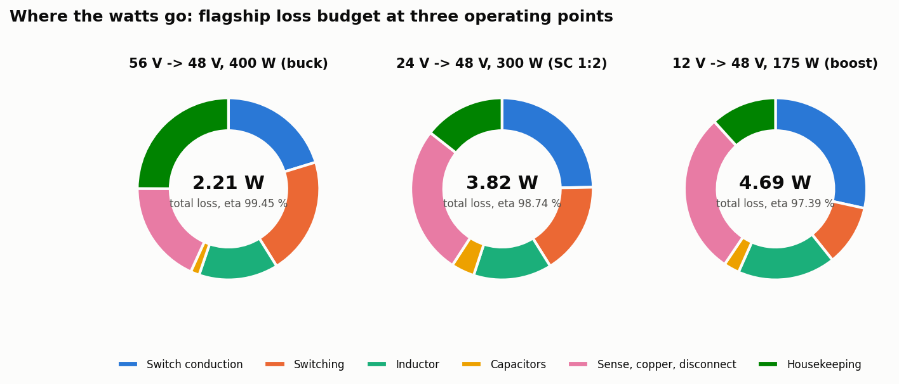

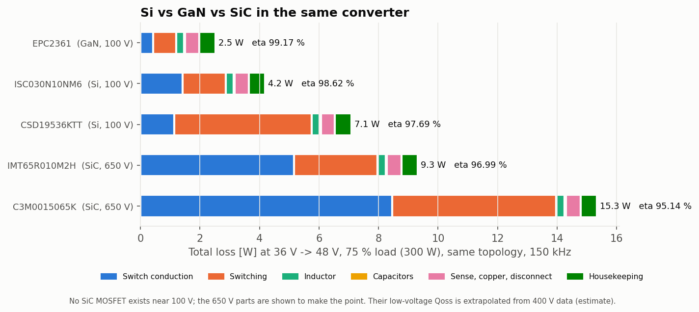


The controller exists twice, in C (`hardware/flagship/control/wf_ctrl.c`) and Python. `tests/test_control.py` runs both in closed loop with the PV model and requires byte-identical output on all 6,200 ticks. The MPPT holds over 99.5 % of the available power in steady sun and finds the global maximum under partial shading. The three-level modulator `hardware/flagship/hdl/wf_pwm3l.v` has a self-checking testbench for shoot-through, dead time, duty, phase, bypass break-before-make and the fault latch. That testbench caught a real counter-saturation bug.

**Flagship deliverables:**

- [Design rationale](hardware/flagship/DESIGN_RATIONALE.md)
- [BOM](hardware/flagship/BOM.csv) with real part numbers and a verification status per line
- [Loss-model spreadsheet](hardware/flagship/loss_model.xlsx) with live formulas that match the Python model to 0.003 W
- [Notebook](notebooks/loss_model.ipynb)
- [ngspice netlist](hardware/flagship/spice/flagship_buck_56V_400W.cir)
- Reference C and Verilog (simulate and review before use)

## The frontier, kilovolts to phone-level

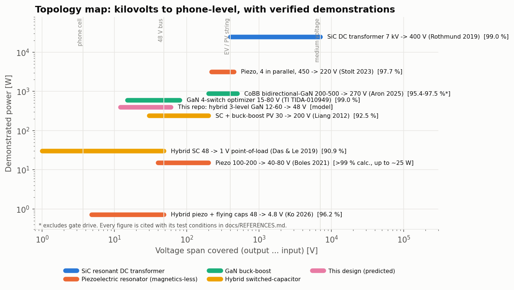

Hybrid switched-capacitor, flying-capacitor multilevel and **piezoelectric-resonator** (magnetics-less) converters, each cited with its exact test conditions in [docs/REFERENCES.md](docs/REFERENCES.md) (last verified 2026-09-30). Some commonly quoted figures turned out to be something else, and the references page says so:

- a 99.2 % that is a PV energy-harvest ratio, not converter efficiency;
- a 96-97 % that could not be verified (the closest real paper reports 92.5 %);
- a >99 % that appears to be calculated, not measured.

## Quick start

```bash
git clone https://github.com/<you>/watt-forge && cd watt-forge
python3 -m pip install --require-hashes -r requirements.lock && python3 -m pip install --no-deps -e .
sudo apt-get install ngspice iverilog     # optional: enables the ngspice and HDL tests
make test                                 # pytest + JS parity + JS/Rust netlist guards
python3 -m http.server -d docs 8000       # then open http://localhost:8000
```

`make data figures site` regenerates the design exploration, web data, charts, animations and pages from source. `make spice` re-runs the SPICE runner presets in ngspice, and `make desktop` builds the desktop installers (see [desktop/README.md](desktop/README.md)).

## Repository map

```
watt_forge/            physics library + flagship (params, pwm, model, sim, control, design)
docs/                  GitHub Pages site (built from site/ by scripts/build_site.py), images, data, docs
  js/model/            browser port of the models (parity-tested)    js/pages/  one module per page
  REFERENCES.md  SECURITY_MODEL.md  EQUATIONS.md  PUBLISH.md
hardware/flagship/     DESIGN_RATIONALE.md, BOM.csv, loss_model.xlsx, control/ (C), hdl/ (Verilog), spice/
desktop/               netlist-guard (Rust, tested) + src-tauri (Tauri 2 app, smoke-tested)
data/                  devices.json (datasheet values + verification flags), references.json, generated results
tests/                 123 Python tests + JS parity (1,751 checks) + JS guard (25 checks) + Rust tests
```

## Reference repos and tools

| Repo / tool | What we borrow or use |
|---|---|
| [ngspice](https://ngspice.sourceforge.io) | Open SPICE engine: desktop back end and cross-check of the Python circuit simulation (run as an external program) |
| [KiCad](https://gitlab.com/kicad/code/kicad) | Schematic and BOM conventions for the reference design |
| [Apache ECharts](https://github.com/apache/echarts) / [plotly.js](https://github.com/plotly/plotly.js) | Considered for charts; the site ships its own small SVG charts to keep a strict CSP with zero third-party scripts |
| PLECS-style loss tables / open converter models | The modelling pattern of the circuit simulation (circuit solved exactly, switching energies added per event); no code borrowed |
| IEEE TPEL / APEC / COMPEL papers | Topology and loss references, all cited by DOI in [docs/REFERENCES.md](docs/REFERENCES.md) |

## Milestones

| Milestone | Status |
|---|---|
| 1. MVP: fundamentals, buck/boost/buck-boost lessons with animations, loss-budget explorer, sources | Done |
| 2. Switched-capacitor and hybrid topologies, Si/GaN/SiC comparison, efficiency-curve validator | Done |
| 3. Flagship: schematic, BOM, loss model, simulation, MPPT sandbox, reference control code | Done (model-level; no hardware built) |
| 4. Frontier library including piezoelectric converters; web and desktop parity | Done. The desktop app is built and smoke-tested, and the SPICE runner page runs ngspice live in it (stored results on the web). The web app installs and works offline |
| 5. Hardening: independent accuracy review, simulator security review, signed releases | Review and security model done. Pushing a `v*` tag publishes one release: source ZIP, SBOM, installers for three OSes, `SHA256SUMS` and Sigstore provenance |

## Security

The site is static and local-first, with a strict CSP and no `eval`. Imported designs and netlists are treated as untrusted, CI uses hash-pinned dependencies and SHA-pinned Actions, and releases ship with an SBOM, checksums and Sigstore provenance. Details: [docs/SECURITY_MODEL.md](docs/SECURITY_MODEL.md).

## License

MIT for code. Cited papers remain their publishers' copyright: they are referenced, never reproduced.
