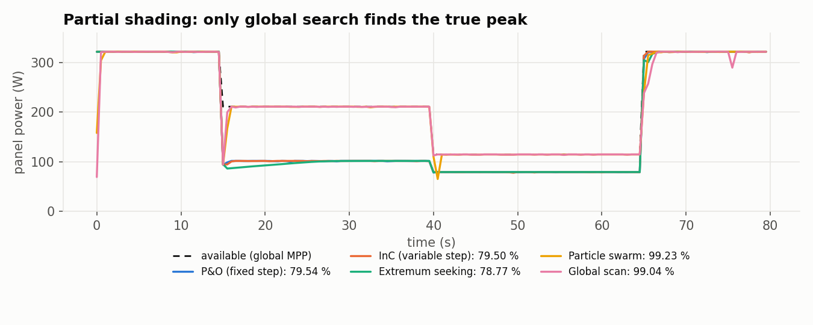
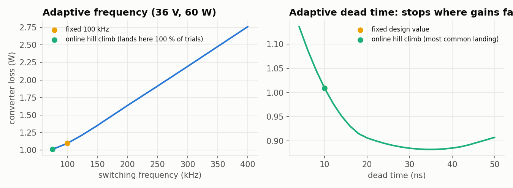

<div align="center">


# Watt Forge

**Converter design from first principles, down to the last milliwatt.**

Lessons, live loss models, a benchmarked control-algorithm library, and a hybrid GaN buck-boost reference design for solar. All of it open, tested, and running in your browser.

[](https://github.com/Normansrule/watt-forge/actions/workflows/ci.yml)
[](https://github.com/Normansrule/watt-forge/releases/latest)
[](https://normansrule.github.io/watt-forge/)
[](https://github.com/Normansrule/watt-forge/releases/latest)
[](LICENSE)

[**Open the web app**](https://normansrule.github.io/watt-forge/) · [Download the desktop app](https://github.com/Normansrule/watt-forge/releases/latest) · [Lessons](https://normansrule.github.io/watt-forge/learn/fundamentals.html) · [Control lab](https://normansrule.github.io/watt-forge/tools/control-lab.html) · [Flagship design](hardware/flagship/DESIGN_RATIONALE.md)

</div>


> [!WARNING]
> **Design and simulation reference, not a build guide.** Solar and battery hardware can injure: high voltage, stored energy, fire. Any physical build is at your own risk and needs proper lab safety practice. Read [SAFETY.md](SAFETY.md).

## Why Watt Forge

- **Every equation is checked.** Each lesson equation has a worked example that the test suite recomputes. The flagship model is cross-checked against a time-domain circuit simulation and ngspice.
- **One implementation, three languages.** The physics and control algorithms are written in Python, ported to JavaScript for the browser and to C as a firmware reference. Tests hold the ports to the Python: JavaScript to rounding error, C decision for decision.
- **Honest numbers.** Every published efficiency figure is cited with its exact test conditions. Estimates are labelled `ESTIMATE`, and predictions are never presented as measurements.
- **Runs anywhere, private by default.** It is a static site with a strict Content Security Policy and no accounts, analytics or third-party requests. It installs as an offline web app, and the desktop app adds a sandboxed ngspice.

## What's inside

| | What | Where |
|---|---|---|
| **Course** | Seven lessons, from duty cycle to the research frontier: topologies, switched-capacitor hybrids, expert loss modelling, Si/GaN/SiC devices, control and MPPT | [`docs/learn/`](https://normansrule.github.io/watt-forge/learn/fundamentals.html) |
| **Tools** | Topology designer, loss-budget explorer, efficiency-curve validator, device comparison, MPPT sandbox, **control lab**, SPICE runner | [`docs/tools/`](https://normansrule.github.io/watt-forge/tools/designer.html) |
| **Control library** | Eight MPPT algorithms and four efficiency controls, benchmarked on EN 50530-style tests | [`watt_forge/control/`](watt_forge/control/), [`wf_mppt.c`](hardware/flagship/control/wf_mppt.c) |
| **Flagship design** | 400 W hybrid three-level GaN buck-boost, 12-60 V panel to a 48 V battery: schematic, BOM, loss model, simulations, controller, modulator | [`hardware/flagship/`](hardware/flagship/) |
| **Desktop app** | Tauri 2: the same site offline, plus live sandboxed ngspice | [`desktop/`](desktop/) |

## Control library <sup>new in 0.2</sup>

Eight maximum power point tracking (MPPT) algorithms run on the same simulated panel, sensors and test profiles. The panel is a 72-cell model with bypass diodes, the input-voltage loop has dynamics, and the sensors add noise and 12-bit quantisation. Every tracker gets the same parameter tuning, on a profile that is never used for scoring. The score is **dynamic MPPT efficiency** as EN 50530 defines it: energy drawn divided by energy available at the global maximum power point. Each result is the mean of three noise seeds.

| Tracker | Family | EN 50530-style 30-100 % | 10-50 % | Clouds | Partial shading | Steady | Overall |
|---|---|---:|---:|---:|---:|---:|---:|
| Particle swarm + variable-step P&O | Global search | 99.77 % | 99.70 % | 98.04 % | 99.23 % | 99.62 % | **99.51 %** |
| Global scan + variable-step P&O | Global search | 99.70 % | 99.65 % | 97.35 % | 99.04 % | 99.55 % | **99.36 %** |
| Perturb & observe, fixed step | Hill climbing | 99.93 % | 99.86 % | 99.15 % | 79.54 % | 99.94 % | **97.61 %** |
| Incremental conductance, variable step | Hill climbing | 99.88 % | 99.83 % | 99.47 % | 79.50 % | 99.91 % | **97.61 %** |
| Incremental conductance, fixed step | Hill climbing | 99.89 % | 99.84 % | 98.67 % | 79.51 % | 99.93 % | **97.54 %** |
| Extremum seeking (injected dither) | Gradient | 99.83 % | 99.76 % | 99.76 % | 78.77 % | 99.83 % | **97.51 %** |
| Perturb & observe, variable step | Hill climbing | 99.89 % | 99.84 % | 97.76 % | 79.49 % | 99.92 % | **97.44 %** |
| Fractional open-circuit voltage | Model based | 98.90 % | 99.47 % | 97.95 % | 77.92 % | 97.75 % | **96.61 %** |



**What the benchmark says:**

- **On slow ramps and in steady light**, every hill climber reaches 99.8-99.9 %.
- **Partial shading** separates the global methods from the rest, by about 20 points.
- **Cloud edges** reward extremum seeking and variable-step incremental conductance, and punish anything that restarts a global search at every edge.

The flagship uses global scan. Particle swarm edges it out here, but the scan has fewer parameters and no random numbers, so its worst case is easier to bound.

**Efficiency controls** on the flagship loss model:

- **Adaptive switching frequency** and **adaptive dead time** are online hill climbs. They see the loss only through power measurements, at the resolution the converter's sensors give after averaging 5 s of readings (about 25-35 mW). Results are means over 20 noise trials.
- **Burst mode** and **bypass** are design-time rules worked out with the model. Burst mode pays for the panel ripple it causes, and bypass pays for pinning the panel at battery voltage.

At 40 V and 20 W (5 % load), the two climbs cut converter loss from 1.04 W to 0.92 W, and burst mode takes it to 0.55 W. Much of that last step comes from idling housekeeping supplies between bursts, which is an estimate. Near full load the controls save a tenth of a watt or nothing, except near V_in = V_out, where adaptive frequency alone saves about half a watt. At full load, noise occasionally moves the dead-time climb off an optimum it started on, costing 0.4 mW on average. The frequency climb usually finds the optimum, while the dead-time climb usually stops short because the remaining gain is below what the sensors can resolve.

Over a modelled clear day the controls recover 1.5 Wh of 2,117 Wh: 1.0 Wh from frequency, 0.16 Wh from dead time and 0.30 Wh from burst mode. That is small, because the converter already sits near 99 % most of the day.



Race them yourself in the [control lab](https://normansrule.github.io/watt-forge/tools/control-lab.html). The method, equations and references are in [lesson 6](https://normansrule.github.io/watt-forge/learn/control.html).

## The flagship: hybrid three-level GaN buck-boost for solar


**12-60 V panel to a 40-58 V (48 V) battery, 400 W, with MPPT.** It is a four-switch buck-boost whose half-bridges are replaced by three-level flying-capacitor legs on 100 V GaN (EPC2361):

- **Half the blocking voltage.** Each switch blocks Vbus/2.
- **Up to 4x less ripple.** The switch node steps in half-size steps at twice the frequency.
- **A built-in switched-capacitor stage.** At Vout = 2 Vin the leg is a soft-charged 2:1 SC converter.

A monolithic bidirectional GaN switch (Innoscience INV100FQ030C) disconnects the panel in both directions. A second one bypasses conversion when the panel already sits at battery voltage.

| Operating point (model) | Mode | f | Loss | Efficiency |
|---|---|---|---|---|
| 56 V -> 48 V, 400 W | buck | 75 kHz | 2.21 W | **99.45 %** |
| 36 V -> 48 V, 300 W | boost | 75 kHz | 2.23 W | 99.26 % |
| 24 V -> 48 V, 300 W | boost, SC 1:2 | 100 kHz | 3.82 W | 98.74 % |
| 12 V -> 48 V, 175 W | boost | 75 kHz | 4.69 W | 97.39 % |
| 48 V, 400 W | bypass | - | 1.07 W | 99.73 % |


**How much to trust these numbers.** Three independent calculations agree: the analytic model; a time-domain circuit simulation within 0.15 points; and ngspice within 5e-5. That proves the arithmetic, not the hardware. The best *measured* GaN buck-boost results we could verify are 99.0 % (TI TIDA-010949, control power excluded) and 99.3 % (Heydari et al., APEC 2023). Treat predictions above about 99.3 % as claims awaiting a prototype.

<details>
<summary><b>Where the physics says no, and the full deliverables list</b></summary>

- **Low input voltage.** At 12 V the converter carries 15 A through four series switches, the inductor and the disconnect, which caps it near 97.4 %.
- **Light load.** Housekeeping dominates; burst mode recovers part of it (see above).
- **Vin = Vout.** Both legs switch, which costs a dip; bypass removes it.

Deliverables: [design rationale](hardware/flagship/DESIGN_RATIONALE.md); [BOM](hardware/flagship/BOM.csv) with real part numbers and a verification status per line; [loss-model spreadsheet](hardware/flagship/loss_model.xlsx) with live formulas; [notebook](notebooks/loss_model.ipynb); [ngspice netlist](hardware/flagship/spice/flagship_buck_56V_400W.cir); the reference controller in [C](hardware/flagship/control/wf_ctrl.c) (identical to Python on every tick of a 6,200-tick closed-loop test); and the three-level modulator in [Verilog](hardware/flagship/hdl/wf_pwm3l.v) with a self-checking testbench. Reference code: simulate and review before use.


</details>

## The frontier, kilovolts to phone-level


The frontier lesson covers hybrid switched-capacitor, flying-capacitor multilevel and **piezoelectric-resonator** (magnetics-less) converters. Each is cited with its exact test conditions in [docs/REFERENCES.md](docs/REFERENCES.md). Where a commonly quoted figure turned out to be something else, the references say so.

## Get started

**Use it:** open the [web app](https://normansrule.github.io/watt-forge/) (your browser's *Install app* makes it work offline). Or download an installer from [Releases](https://github.com/Normansrule/watt-forge/releases/latest): `.deb`, `.rpm` or `.AppImage` for Linux, `.msi` or `.exe` for Windows, `.dmg` for macOS.

**Develop:**

```bash
git clone https://github.com/Normansrule/watt-forge && cd watt-forge
python3 -m pip install --require-hashes -r requirements.lock && python3 -m pip install --no-deps -e .
sudo apt-get install ngspice iverilog     # optional: ngspice and HDL tests
make test                                 # Python, JavaScript parity, guards and control library, Rust
python3 -m http.server -d docs 8000       # the site at http://localhost:8000
```

| Command | What it regenerates |
|---|---|
| `make data figures site` | Design exploration, web data, charts, animations, pages |
| `make tune` then `make control` | MPPT tuning, benchmark, efficiency controls, daily energy (about 15 min) |
| `make spice` | ngspice results shown by the SPICE runner |
| `make desktop` | Desktop installers ([desktop/README.md](desktop/README.md)) |

Publishing from a blank Ubuntu terminal takes one paste: [docs/PUBLISH.md](docs/PUBLISH.md).

<details>
<summary><b>Repository layout</b></summary>

```
watt_forge/            physics library
  flagship/            flagship params, PWM, loss model, circuit simulation, controller, design exploration
  control/             MPPT trackers, closed-loop bench, profiles, efficiency controls
site/                  page sources -> docs/*.html (scripts/build_site.py)
docs/                  the GitHub Pages site and the desktop app's UI
  js/model/            browser ports (parity-tested)   js/pages/  one module per page   js/workers/  benchmark worker
  REFERENCES.md  SECURITY_MODEL.md  EQUATIONS.md  PUBLISH.md
hardware/flagship/     DESIGN_RATIONALE.md, BOM.csv, loss_model.xlsx, control/ (C), hdl/ (Verilog), spice/
desktop/               Tauri 2 app + netlist-guard (Rust)
data/                  devices, references, tuned parameters, generated results
scripts/               every generator (data, charts, site, icons, ZIP)
tests/                 Python tests + JS parity fixtures and checks
```
</details>

## Verification

| Suite | What it proves |
|---|---|
| `pytest` (154 tests) | Worked examples; model vs circuit simulation vs ngspice; C == Python for the flagship controller, all eight trackers and the online optimiser; HDL testbench; site security; data freshness |
| `node tests/js/parity.mjs` (1,751 checks) | Browser physics == Python physics |
| `node tests/js/control.mjs` (1,098 checks) | Browser control library == Python, decision for decision |
| `node tests/js/guard.mjs` + `cargo test` | One netlist-guard rule set in Python, JavaScript and Rust |
| Desktop smoke test | Page -> IPC -> guard -> ngspice, in the packaged app, on every release build |

## Project

- **Contributing:** see [CONTRIBUTING.md](CONTRIBUTING.md). Cite with conditions, keep the three implementations in step, and commit generated files.
- **Security:** report vulnerabilities privately as described in [SECURITY.md](SECURITY.md). The threat model is [docs/SECURITY_MODEL.md](docs/SECURITY_MODEL.md). Releases ship with an SBOM, checksums and Sigstore provenance, and every Action is pinned by commit SHA.
- **Citing:** use [CITATION.cff](CITATION.cff) (GitHub's *Cite this repository* button).
- **Changes:** see [CHANGELOG.md](CHANGELOG.md).
- **License:** MIT for code. Cited papers remain their publishers' copyright: they are referenced, never reproduced. Fonts: Inter and JetBrains Mono (SIL OFL 1.1).
